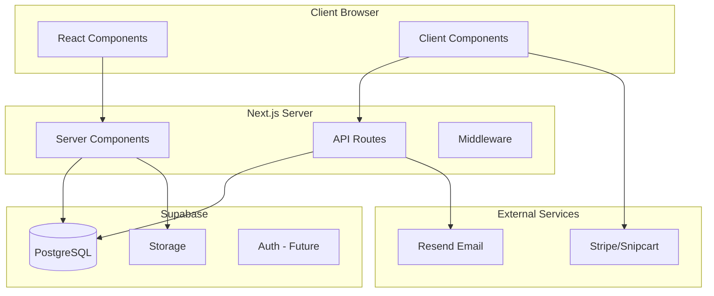

# Design Document: Nyce Days Website

## Overview

The Nyce Days website is a portfolio and community platform built with Next.js 14 App Router, featuring server-side rendering for SEO, Supabase for data persistence, and a modern component architecture. The design prioritizes a clean, minimal aesthetic with warm VHS video backgrounds and efficient modern UI patterns.

The architecture follows Next.js App Router conventions with:
- Server Components for data fetching and SEO
- Client Components for interactivity (forms, lightbox, animations)
- API Routes for form submissions
- Supabase for database and storage

## Architecture



### Directory Structure

```
nyce-days/
├── app/
│   ├── layout.tsx              # Root layout with fonts, providers
│   ├── page.tsx                # Home page
│   ├── about/page.tsx
│   ├── services/page.tsx
│   ├── portfolio/
│   │   ├── page.tsx            # Portfolio grid
│   │   └── [slug]/page.tsx     # Project detail
│   ├── media/page.tsx
│   ├── community/page.tsx
│   ├── shop/
│   │   ├── page.tsx            # Shop grid/empty state
│   │   └── [slug]/page.tsx     # Product detail
│   ├── contact/page.tsx
│   └── api/
│       ├── contact/route.ts
│       └── subscribe/route.ts
├── components/
│   ├── ui/                     # Shadcn components
│   ├── layout/
│   │   ├── nav.tsx
│   │   ├── mobile-nav.tsx
│   │   └── footer.tsx
│   ├── home/
│   │   ├── hero.tsx
│   │   ├── what-we-do.tsx
│   │   ├── featured-work.tsx
│   │   └── stats-bar.tsx
│   ├── portfolio/
│   │   ├── project-grid.tsx
│   │   ├── project-card.tsx
│   │   └── project-gallery.tsx
│   ├── media/
│   │   └── media-gallery.tsx
│   ├── shop/
│   │   ├── product-grid.tsx
│   │   ├── product-card.tsx
│   │   └── empty-state.tsx
│   ├── community/
│   │   ├── event-card.tsx
│   │   └── newsletter-form.tsx
│   └── shared/
│       ├── video-background.tsx
│       ├── fade-up.tsx
│       ├── section.tsx
│       └── lightbox.tsx
├── lib/
│   ├── supabase/
│   │   ├── client.ts
│   │   ├── server.ts
│   │   └── admin.ts
│   ├── queries/
│   │   └── index.ts
│   ├── utils.ts
│   └── schemas.ts
├── types/
│   └── database.ts
└── styles/
    └── globals.css
```

## Components and Interfaces

### Layout Components

#### Nav Component
```typescript
// components/layout/nav.tsx
interface NavProps {
  className?: string
}

// Server component that renders navigation
// Links: Home, About, Services, Portfolio, Media, Community, Shop, Contact
// Desktop: horizontal nav bar
// Mobile: hamburger icon triggering MobileNav
```

#### MobileNav Component
```typescript
// components/layout/mobile-nav.tsx
'use client'

interface MobileNavProps {
  isOpen: boolean
  onClose: () => void
}

// Client component using Shadcn Sheet
// Slide-out menu with all navigation links
// Closes on link click or outside click
```

#### Footer Component
```typescript
// components/layout/footer.tsx
interface FooterProps {
  className?: string
}

// Server component with:
// - Logo and tagline
// - Navigation links
// - Social media links (Instagram)
// - Newsletter signup form
// - Copyright
```

### Home Page Components

#### Hero Component
```typescript
// components/home/hero.tsx
interface HeroProps {
  videoSrc?: string
  posterSrc?: string
}

// Full-screen hero with:
// - VideoBackground component
// - Centered logo
// - Tagline "Have A Nyce Day!"
// - CTA button linking to /contact
```

#### WhatWeDo Component
```typescript
// components/home/what-we-do.tsx
interface ServiceItem {
  title: string
  description: string
  icon?: React.ReactNode
}

// 3-column grid of service cards
// Event Curation, Community Marketing, Content Creation
```

#### FeaturedWork Component
```typescript
// components/home/featured-work.tsx
interface FeaturedWorkProps {
  projects: ProjectWithMedia[]
}

// Server component that displays up to 3 featured projects
// Uses ProjectCard component
```

#### StatsBar Component
```typescript
// components/home/stats-bar.tsx
interface Stat {
  value: string
  label: string
}

// Horizontal bar with key metrics
// 100K+ impressions, 10+ team, 3 markets
```

### Portfolio Components

#### ProjectGrid Component
```typescript
// components/portfolio/project-grid.tsx
'use client'

interface ProjectGridProps {
  projects: ProjectWithMedia[]
  categories: string[]
}

// Client component with:
// - Filter tabs (All, Events, Content, Partnerships)
// - Grid of ProjectCard components
// - Client-side filtering
```

#### ProjectCard Component
```typescript
// components/portfolio/project-card.tsx
interface ProjectCardProps {
  project: ProjectWithMedia
}

// Card with:
// - Hero image with hover effect
// - Title, category, date
// - Link to /portfolio/[slug]
```

#### ProjectGallery Component
```typescript
// components/portfolio/project-gallery.tsx
'use client'

interface ProjectGalleryProps {
  media: Media[]
}

// Client component with:
// - Grid of thumbnails
// - Lightbox on click
// - Navigation between images
```

### Shop Components

#### ProductGrid Component
```typescript
// components/shop/product-grid.tsx
'use client'

interface ProductGridProps {
  products: ProductWithImages[]
  categories: string[]
}

// Client component with:
// - Filter tabs (All, Apparel, Accessories, Tickets)
// - Grid of ProductCard components
```

#### ProductCard Component
```typescript
// components/shop/product-card.tsx
interface ProductCardProps {
  product: ProductWithImages
}

// Card with:
// - Primary product image
// - Name, price, compare price (if on sale)
// - Link to /shop/[slug]
```

#### EmptyState Component
```typescript
// components/shop/empty-state.tsx
interface EmptyStateProps {
  title?: string
  description?: string
}

// Displayed when no products are published
// "No drops right now. Check back soon."
// Newsletter signup CTA
```

### Community Components

#### EventCard Component
```typescript
// components/community/event-card.tsx
interface EventCardProps {
  event: EventWithFlyer
}

// Card with:
// - Flyer image
// - Event title, date, location
// - Ticket link button (if available)
```

#### NewsletterForm Component
```typescript
// components/community/newsletter-form.tsx
'use client'

interface NewsletterFormProps {
  source?: 'footer' | 'community' | 'shop'
  className?: string
}

// Client component with:
// - Email input with validation
// - Submit button
// - Success/error states
// - Submits to /api/subscribe
```

### Shared Components

#### VideoBackground Component
```typescript
// components/shared/video-background.tsx
interface VideoBackgroundProps {
  src: string
  poster: string
  overlay?: string  // Tailwind class, default "bg-black/50"
  children: React.ReactNode
}

// Full-screen video background with:
// - Autoplay, muted, loop video
// - Poster image fallback
// - Overlay for text readability
// - Children rendered on top
```

#### FadeUp Component
```typescript
// components/shared/fade-up.tsx
'use client'

interface FadeUpProps {
  children: React.ReactNode
  delay?: number
  className?: string
}

// Framer Motion wrapper that:
// - Fades in and slides up on viewport entry
// - Configurable delay for staggered animations
```

#### Section Component
```typescript
// components/shared/section.tsx
interface SectionProps {
  children: React.ReactNode
  className?: string
  id?: string
}

// Consistent section wrapper with:
// - Max-width container
// - Vertical padding
// - Optional id for anchor links
```

#### Lightbox Component
```typescript
// components/shared/lightbox.tsx
'use client'

interface LightboxProps {
  images: { src: string; alt: string }[]
  initialIndex?: number
  isOpen: boolean
  onClose: () => void
}

// yet-another-react-lightbox wrapper with:
// - Full-screen image view
// - Navigation arrows
// - Close button
// - Keyboard navigation
```

## Data Models

### Database Schema (Existing)

The database schema is already defined in `supabase-schema.sql` with the following tables:

- **projects**: Portfolio case studies with title, slug, description, content, category, services, featured/published flags
- **media**: Images and videos with storage path, dimensions, alt text, category
- **products**: Shop items with name, slug, price, variants, inventory
- **product_images**: Junction table linking products to media
- **events**: Upcoming/past events with date, location, ticket info
- **subscribers**: Newsletter signups with email and source
- **contact_submissions**: Contact form entries
- **site_settings**: Key-value configuration store

### TypeScript Types (Existing)

Types are defined in `types-database.ts`:

```typescript
// Core types
type Media = Database['public']['Tables']['media']['Row']
type Project = Database['public']['Tables']['projects']['Row']
type Product = Database['public']['Tables']['products']['Row']
type Event = Database['public']['Tables']['events']['Row']
type Subscriber = Database['public']['Tables']['subscribers']['Row']
type ContactSubmission = Database['public']['Tables']['contact_submissions']['Row']

// Extended types with relations
type ProjectWithMedia = Project & { hero_media: Media | null }
type ProductWithImages = Product & { images: (ProductImage & { media: Media })[] }
type EventWithFlyer = Event & { flyer: Media | null }
```

### Validation Schemas

```typescript
// lib/schemas.ts
import { z } from 'zod'

export const contactFormSchema = z.object({
  name: z.string().min(1, 'Name is required').max(100),
  email: z.string().email('Invalid email address'),
  company: z.string().max(100).optional(),
  inquiry_type: z.enum(['partnership', 'event', 'content', 'general']),
  message: z.string().min(10, 'Message must be at least 10 characters').max(5000),
  referral: z.string().max(200).optional()
})

export const subscribeSchema = z.object({
  email: z.string().email('Invalid email address'),
  source: z.enum(['footer', 'community', 'shop', 'contact']).optional()
})

export type ContactFormData = z.infer<typeof contactFormSchema>
export type SubscribeData = z.infer<typeof subscribeSchema>
```

### API Route Handlers

```typescript
// app/api/contact/route.ts
export async function POST(request: Request) {
  // 1. Parse and validate request body with contactFormSchema
  // 2. Insert into contact_submissions table
  // 3. Send email notification via Resend
  // 4. Return success response or error
}

// app/api/subscribe/route.ts
export async function POST(request: Request) {
  // 1. Parse and validate request body with subscribeSchema
  // 2. Upsert into subscribers table (handle duplicates)
  // 3. Return success response or error
}
```


## Correctness Properties

*A property is a characteristic or behavior that should hold true across all valid executions of a system—essentially, a formal statement about what the system should do. Properties serve as the bridge between human-readable specifications and machine-verifiable correctness guarantees.*

### Property 1: Featured Projects Filter

*For any* project returned by the `getFeaturedProjects` query, the project must have `featured=true` AND `published=true`.

**Validates: Requirements 3.5**

### Property 2: Project Category Filter

*For any* category filter value and *for any* project returned by `getAllProjects(category)`, if the category is not 'all', then the project's category must equal the filter value.

**Validates: Requirements 4.2**

### Property 3: Adjacent Project Navigation

*For any* project in the published projects list, the `getAdjacentProjects` function must return:
- `prev` as the project immediately before in sort order (or null if first)
- `next` as the project immediately after in sort order (or null if last)

**Validates: Requirements 4.4**

### Property 4: Media Category Filter

*For any* category filter value and *for any* media item returned by `getMediaByCategory(category)`, if the category is not 'all', then the media's category must equal the filter value.

**Validates: Requirements 5.2**

### Property 5: Email Validation

*For any* string that is not a valid email format (missing @, invalid domain, etc.), the `subscribeSchema.safeParse()` must return `success: false` with an appropriate error message.

**Validates: Requirements 6.6**

### Property 6: Contact Form Validation

*For any* contact form data where a required field (name, email, inquiry_type, message) is missing or invalid, the `contactFormSchema.safeParse()` must return `success: false` with error messages for each invalid field.

**Validates: Requirements 8.5**

### Property 7: Newsletter Subscription Round-Trip

*For any* valid email address, submitting to the `/api/subscribe` endpoint and then querying the `subscribers` table must return a record with that email and `subscribed=true`.

**Validates: Requirements 6.5, 11.2**

### Property 8: Contact Submission Round-Trip

*For any* valid contact form data, submitting to the `/api/contact` endpoint and then querying the `contact_submissions` table must return a record with matching name, email, inquiry_type, and message.

**Validates: Requirements 8.4, 11.1**

### Property 9: API Validation Error Response

*For any* invalid request body sent to `/api/contact` or `/api/subscribe`, the API must return a 400 status code with a JSON body containing error details.

**Validates: Requirements 11.4**

## Error Handling

### Client-Side Errors

| Error Type | Handling |
|------------|----------|
| Form validation | Display inline error messages under each invalid field |
| Network failure | Show toast notification with retry option |
| 404 Not Found | Render Next.js not-found page |
| API error (4xx/5xx) | Show error message in form, log to console |

### Server-Side Errors

| Error Type | Handling |
|------------|----------|
| Database connection | Return 500 with generic error message, log details |
| Validation failure | Return 400 with Zod error details |
| Email send failure | Log error, still return success for form submission |
| Missing environment vars | Throw at startup, prevent deployment |

### Error Response Format

```typescript
// Success response
{ success: true, data?: any }

// Error response
{ 
  success: false, 
  error: string,
  details?: Record<string, string[]>  // Field-level errors
}
```

## Testing Strategy

### Dual Testing Approach

This project uses both unit tests and property-based tests for comprehensive coverage:

- **Unit tests**: Verify specific examples, edge cases, and integration points
- **Property tests**: Verify universal properties across many generated inputs

### Testing Framework

- **Test Runner**: Vitest
- **Property-Based Testing**: fast-check
- **Component Testing**: React Testing Library (optional, for UI components)

### Property-Based Test Configuration

Each property test must:
- Run minimum 100 iterations
- Reference the design document property number
- Use the tag format: `Feature: nyce-days-website, Property N: [property text]`

### Test File Structure

```
__tests__/
├── lib/
│   ├── queries.test.ts       # Unit tests for query functions
│   ├── queries.property.ts   # Property tests for query functions
│   └── schemas.test.ts       # Unit + property tests for validation
├── api/
│   ├── contact.test.ts       # API route tests
│   └── subscribe.test.ts     # API route tests
└── components/
    └── newsletter-form.test.tsx  # Component tests (optional)
```

### Unit Test Focus Areas

- Zod schema validation edge cases (empty strings, special characters)
- Query function error handling (database errors, not found)
- API route response formats
- Component rendering with various props

### Property Test Focus Areas

- Data filtering correctness (categories, featured flag)
- Validation schema completeness
- Round-trip data integrity (submit → query)
- API error response consistency
